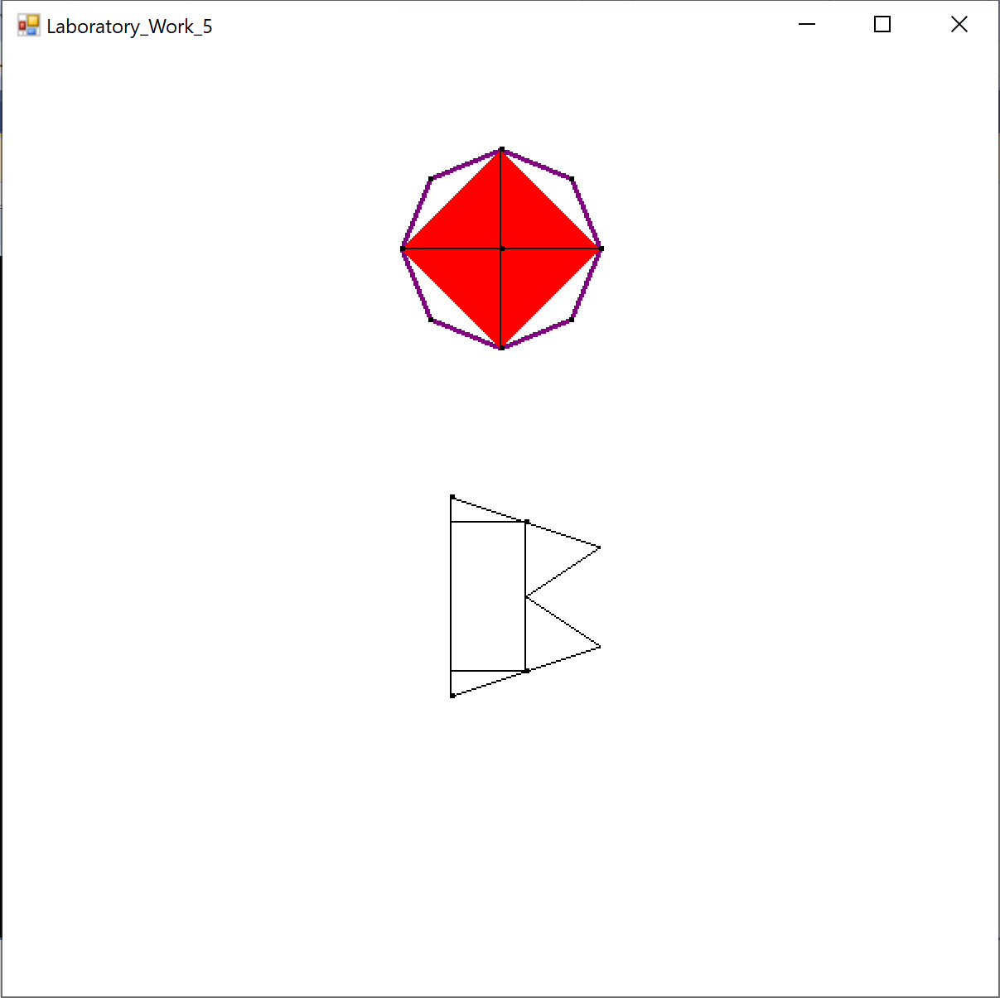
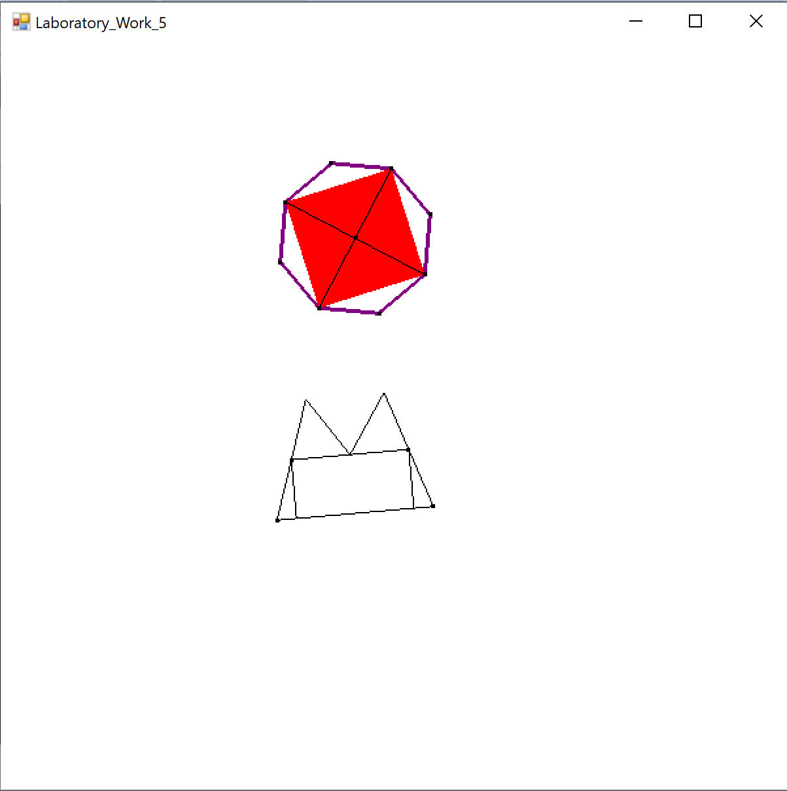
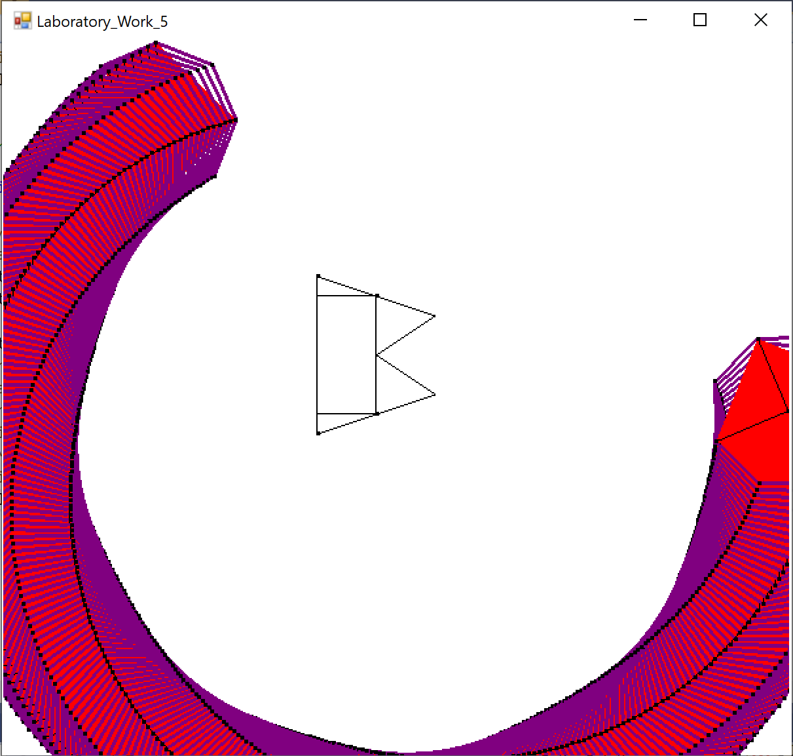

# OpenGL2DFigures
A C# program to draw two 2D figures using OpenGL.

## Technologies used in this project:


<br />

## Info:
The program is built using OpenTK framework which is a C# graphics library superseding the Tao Framework. The program creates two unique shapes **Figure 1** and **Figure 2** and brings motion into them using OpenGL methods such as **GL.Rotate** and **GL.Scale**. Both figures can change their position based on the unique keyboard keys assigned to them. Both figures can scaleUp, ScaleDown and rotate clockwise and counterclockwise. Additionally, **Figure 1** can rotate clockwise and counterclockwise around **Figure 2**. The following program can be used as a base for a simple 2D game.

The keybinding for **Figure 1** are as follows:
```shell
W - Move up
S - Move Down
A - Move Left
D - Move Right
Z - Scale up
X - Scale down
Q - Counterclockwise rotation
E - Clockwise rotation
O - Counterclockwise rotation around Figure 2
P - Clockwise rotation around Figure 2
```

The keybinding for **Figure 2** are as follows:
```shell
Y - Move up
H - Move Down
G - Move Left
J - Move Right
V - Scale up
B - Scale down
T - Counterclockwise rotation
U - Clockwise rotation
```

The project should be opened in **Microsoft Visual Studio**. Simply compile the project and run it. You will be presented with an interface. You can move the figures around.

<p align="center">
  
</p>

Figures can also be rotated clockwise and counterclockwise.

<p align="center">
  
</p>

Figure 1 can be rotated around Figure 2 in clockwise and counterclockwise direction.

<p align="center">
  
</p>

<br />

## Note

Feel free to download the project and build upon it. Happy coding!
